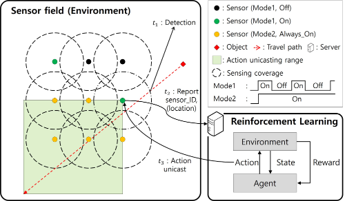
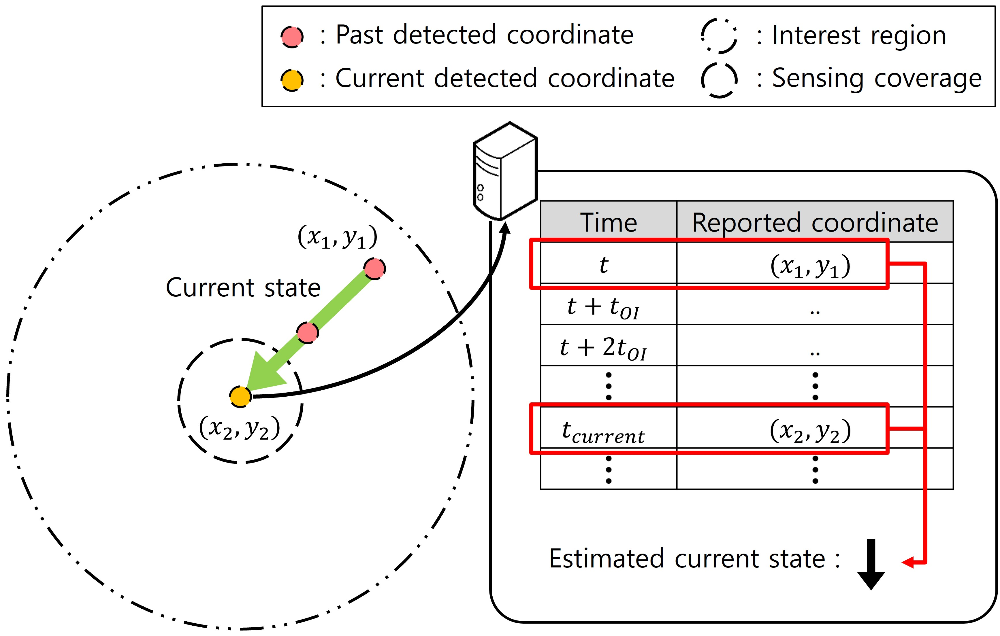
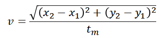

### 무선 센서 네트워크에서 강화학습 기반의 동적 듀티 사이클 모드 선택 방법  

### :heavy_check_mark:핵심  

[2021.11 한국통신학회 논문지(KCI) 게재](https://www.dbpia.co.kr/journal/articleDetail?nodeId=NODE10757062)  

**기간** : 2021/12 ~ 2021/11  

  

**프로젝트 요약** : 무선 센서 네트워크 환경에서 센서 노드들은 지속적으로 데이터를 수집해 싱크로 전송하여 환경을 실시간으로 모니터링 한다. 이러한 환경의 센서는 자원에 한계가 있으므로 에너지를 효율적으로 사용하는 것이 중요하다. 또한, 무선 센서 네트워크에서 객체 추적을 할 때 객체 추적 정확도 역시 중요한 요구사항이다. 두 가지 사항을 모두 높은 수준으로 만족시키기 위해 본 논문에서는 강화학습 기반으로 객체의 미래 이동을 예측하여 센싱 모드를 동적으로 전환하는 방안을 제안한다. 강화학습을 위하여 센서 노드들에서 싱크로 전송된 센싱 데이터를 이용해 객체의 속력과 방향을 나타내는 현재 상태를 정의한다. 이를 Q-learning에 사용하여 센서 영역의 센서들을 각 상태에 맞는 최적의 모드로 전환시킨다. 모의실험을 통해 제안된 방법이 객체 추적 시 높은 정확도를 만족한 상태에서 에너지 효율성도 증대시키는 것을 확인하였다.  

**역할** : 멘토

* 연구의 진행 방향에 대해서 제시하고 시뮬레이션의 결과를 분석하여 설명하고 수정 방향에 대해 제시하는 리더의 역할 경험  
* 강화학습에 필요한 Environment로 객체 이동 모델 및 센서 노드가 배치된 시뮬레이션 환경 제공  
* 리뷰어의 요청으로 Kalman filter를 이용한 시뮬레이션 결과 추가로 구현해야했다. 이름은 들어봤지만 자세히는 모르는 알고리즘이었고 학부 연구생들의 경우에는 아예 들어본 적도 없는 알고리즘이었다. 이에 Kalman filter를 혼자 먼저 공부하고 학부 연구생들에게 개념을 설명하고 시뮬레이션 환경에 어떻게 응용해서 적용해야하는지에 대해 제시하였다. 아래는 파일로 남아 있는 그 일부이다.  

  

* 제안된 Q-Learning을 이용한 방식, Kalman Filter, Dead Reckoning 각각의 알고리즘 특성을 이해하고 이 특성이 시뮬레이션 결과에 어떻게 반영 되었는지 분석하는 능력을 키울 수 있었다.  
  * Kalman Filter와 Dead Reckoning과 같이 선형 역학계의 상태를 추정하는 알고리즘은 객체 이동이 비선형적일 때 성능이 크게 떨어진다.   
    * 객체 이동이 비선형적일 때 이 알고리즘들로 객체의 다음 위치를 예측하여 센서를 동작시키면 객체 감지가 원활하지 못하게 된다.   
  * Q-Learning은 학습 시에 객체 위치의 불확실성 역시 반영할 수 있다.  
    * 객체가 비선형으로 움직일 때 에너지를 다소 소모하더라도 더 넓은 지역의 센서가 동작하게 하여 높은 정확도를 유지할 수 있다.   
    * 객체 이동이 선형적인 경우에는 에너지 소모를 줄이는 방향으로 센서가 동작하기 때문에 Kalman Filter와 Dead Reckoning과 같은 알고리즘과 비슷한 성능을 보인다.  

 

### :heavy_check_mark: 프로젝트 정리

### 서론  

* 무선 센서 네트워크에서 센서 노드들은 배터리로 동작하기 때문에 배터리의 수명이 다하면 데이터를 수집할 수 없다. 따라서 에너지 소모를 줄여 네트워크의 전체적인 수명을 늘리는 연구가 많이 진행되고 있다.

* 센서 네트워크를 활용한 다양한 응용 연구 중에서 이동 객체 추적 기법은 활발하게 연구되고 있는 응용 연구 중 하나이다. 무선 센서 네트워크에서 에너지 소모를 줄이고 높은 정확도로 객체를 추적하기 위해 많은 연구가 진행되고 있다.

* 현재 듀티 사이클과 관련된 연구들은 에너지 효율성에만 초점을 맞춰 객체 추적의 정확도는 고려하지 않는다는 한계점이 있다. 

* 따라서 강화학습 기법 중 하나인 Q-learning을 사용하여 객체가 이동할 범위를 사전에 예측하고 센서의 듀티 사이클 모드를 반복적으로 전환해 에너지 소모는 낮추고 객체를 안정적으로 추적할 수 있는 방법을 제안한다.

  [*이를 순환신경망을 이용하여 해결하고자 한 연구*](https://github.com/seunghee73/RNN-project)

 

### 강화학습을 이용한 센싱 모드 동작 제어 방법  

  

* 센서의 동작 방식으로 두 가지 듀티 사이클 모드를 사용한다.  
  * 모드 1은 슬립 상태와 웨이크업 상태를 반복하는 모드로 설정한다.  
  * 모드 2는 웨이크업 상태를 지속하는 모드로 설정한다.  
* 네트워크에서 객체의 이동을 감지한 센서들은 싱크로 센서의 위치 및 감지 시간을 전송하고 해당 정보들을 이용하여 객체가 이동하는 방향과 속도에 대해서 추정한다.  
* 추정한 값을 이용하여 Q-Learning에 사용하기 위한 현재 상태(state)에 대해서 정의하고 강화학습을 통해 각 상태에서 최적으로 선택된 범위의 센서들을 모드 2로 전환한다.   

 

#### Q-Learning  

      

* 객체의 움직임을 예측해 최적의 센싱 모드에 대해 실시간으로 수학적으로 도출하는 것이 쉽지 않다는 점을 고려해 센서의 센싱 모드 제어 방법으로 Q-learning을 사용한다.   
  * Q-Learning은 행동을 평가하는 가치 함수(Q-Value)에 의해 양 또는 음의 보상을 부여함으로써 점진적으로 각 상태에 따른 최적의 행동을 찾아낸다. 수식은 다음과 같다.  

  

*  학습의 정확도를 높이기 위해 최적의 행동을 선택할 때 decayed epsilon greedy 방식을 사용한다.  
  * 이를 이용하여 학습 초기에는 대부분 무작위로 행동을 선택하도록 하여 여러 행동을 탐색하도록 하고 후기에는 가치 함수가 최대인 행동을 선택하도록 한다. 과정은 아래와 같다.    

  

 

#### 동적 센싱 모드 제어 방법

* 제안하는 동적 센싱 모드 제어 방법은 센서 네트워크상의 모든 센서 노드는 모드1을 기본으로 동작하도록 하여 소모 에너지를 크게 절감하고, Q-learning을 이용해 객체의 예상 이동 경로에 위치한 센서는 모드2로 미리 변경하여 감지 정확도를 일정 수준으로 확보한다.    

* 센싱 모드의 자연스러운 동작을 위해 두 가지 조건을 추가한다.   
  * 첫 번째는 모드1에서 객체를 감지하는 경우 해당 센서를 모드2로 즉시 전환하도록 설계하는 것이다.   
  * 두 번째는 Q-learning을 통해 모드2로 전환한 경우, 이로부터 일정 시간이 경과될 때까지 객체를 감지하지 못하면 모드1로 되돌아가도록 설정한다.  반면 그 전에 감지한 경우 객체가 감지 반경을 벗어나 감지되지 않을 때까지 모드2를 유지한다.  

    

* Q-Learning 모델의 환경 설정을 위해 우선 **현재 상태(state)**를 정의한다.

  * 현재 상태는 객체의 움직임을 나타내는 벡터로 속력과 방향을 나타내도록 설정한다.

  * 싱크로 전달된 데이터 중 일정 시간 이내에 해당 영역 안에서 감지된 데이터를 이용해 객체 움직임에 대한 벡터를 계산한다.

  * 이를 수식으로 나타내면 아래와 같다.

      

      

    

  * Q-Learning의 상태를 너무 다양하게 정의하게 되면 학습에 어려움이 있기 때문에 방향과 근사화를 통해 속도에 따라 17개의 상태로 구분한다.
  
  * 이를 구하는 수식은 다음과 같다.
  
      
  
* 객체를 감지한 센서는 서버로부터 최대 가치 함수를 갖는 행동을 전달 받아 주변 센서로 유니캐스트 한다. 

    

* 행동을 전달 받게 되는 영역을 Q-Learning의 **행동(action)**으로 설정하며 이는 18가지로 정의한다.
  * 영역별로 다양한 행동을 정의한 이유는 각 상태에 대한 가장 효율적인 행동을 선택하기 위함이다.
  
* 유니캐스트로 행동을 전달 받은 센서는 즉시 모드2로 전환한다. 

      

* 행동 선택에 영향을 미치는 가치 함수를 계산하여 Q-table을 갱신하기 위해 **보상 함수(reward function)**가 필요하다. 수식은 다음과 같다.

  

  * action에 의해 활성화된 범위에 있는 센서 노드들 중 활성화된 센서 노드에 대한 비율을 positive reward로 설정했다.  
  * 활성화된 범위 바깥 부분에 있는 센서 노드들 중 활성화된 센서 노드들의 비율을 negative reward로 설정하고 추가적으로 가중치 베타를 설정하였다.  

 

### 모의실험 및 결과

#### Q-Learning 수렴 확인

    

* 특정 상태를 방문한 횟수에 따른 최대 가치 함수 값의 변화를 나타낸다. 그래프의 x축은 특정 상태를 방문한 횟수이며 y축은 특정 상태의 최대 가치 함수이다.
* 상태를 방문한 횟수가 증가함에 따라 최대 가치 함수가 증가하다가 수렴하는 형태를 보이는 것을 확인할 수 있다.

    

* 특정 상태에서 최대 가치 함수를 갖는 행동을 나타낸 것이다. 그래프의 x축은 특정 상태를 방문한 횟수이고 y축은 특정 상태의 최대 가치 함수를 갖는 행동을 의미한다. 
* 상태를 방문한 횟수가 증가할수록 최대 가치 함수를 갖는 행동이 수렴하는 것을 확인할 수 있다. 최대 가치 함수를 갖는 행동이 한 개로 수렴하지 않는 이유는 학습의 문제가 아닌 센서 배치 때문에 생기는 결과이다.

 

#### 객체 이동 모델에 따른 시뮬레이션 결과

* 제안하는 동적 센싱 모드 방법과 비교 모델로 모든 센서가 모드1로 동작하는 센싱 모델과 Dead-reckoning을 적용한 센싱 모델, 칼만 필터를 적용한 센싱 모델과의 비교를 진행하였다. 

* 실험 환경1의 경우에는 목적지까지 이동하는데 걸리는 시간이 Q-table 갱신 지연 시간인  *T* 와 같거나 보다 긴 곳에 위치한 목적지를 선택하도록 하였다.

    

* 동적 센싱 모드 제어 방법, Dead-reckoning과 칼만 필터를 적용한 센싱 모델 모두 매우 높은 성능을 보이는 것을 확인할 수 있다.     

* 실험 환경2는 위 그림과 같이 전체 센서 필드에서 다음 이동점을 구하고 랜덤하게 선택된 속도와 방향으로 이동하는데, 그림 14와 같이 매 *T* 시간마다 진행 방향에서 0~180˚ 범위에서 랜덤하게 방향을 변경하여 이동한다. 객체의 이동 시간이 최단 경로로 이동했을 때 걸리는 시간보다 초과되면 마지막 위치에서 정지하여 새로운 목적지와 속도를 결정하며 이후 이 과정을 반복한다. 이 방식은 객체가 목적지의 방향으로 이동을 하지만 최종적으로 목적지에 도착하지 않을 수 있다. 

    

* 실험 환경2와 같이 객체의 움직임이 자주 변하는 환경에서는 Dead-reckoning과 칼만 필터를 적용한 센싱 모델에 비해 제안하는 방식이 약 6%이상 높은 성능을 보이는 것을 확인할 수 있다. 

    

* 실험 환경3은 객체의 목적지가 전체 센서 필드가 아니라 위 그림과 같이 현재 위치에서 두 개의 센서 평균 거리 내로 다음 목적지를 선정하도록 하였다. 목적지의 위치가 가깝기 때문에 목적지에 도착하게 되면 정지하지 않고 바로 다음 목적지를 결정해서 이동한다.

    

* 동적 센싱 모드 제어 방법은 여전히 매우 높은 성능을 보이지만 Dead-reckoning을 적용한 센싱 모델과 칼만 필터를 적용한 센싱 모델은 낮은 성능을 보이는 것을 확인하였다.

 

### 결론

* Dead-reckoning과 칼만 필터를 적용한 센싱 모델의 경우에는 실험 환경1과 같이 객체의 이동에 대한 예측이 쉬운 환경에서는 높은 성능을 보이는 것을 확인할 수 있다. 

* 반면 실험 환경2와 같이 거시적인 관점에서는 목적지의 방향으로 이동하지만 미시적인 관점에서 움직임에 대한 예측이 어려운 경우에는 다소 성능이 떨어지고 실험 환경3과 같이 객체의 이동 속도와 방향이 자주 바뀌는 환경에서는 낮은 성능을 보이는 것을 확인할 수 있다. 

* 이에 반해 동적 센싱 모드 제어 방법은 갑작스러운 객체의 움직임 변화에 의해 객체의 이동에 대한 예측이 어려운 환경에도 높은 성능을 보이는 것을 확인할 수 있다. 

  

 
